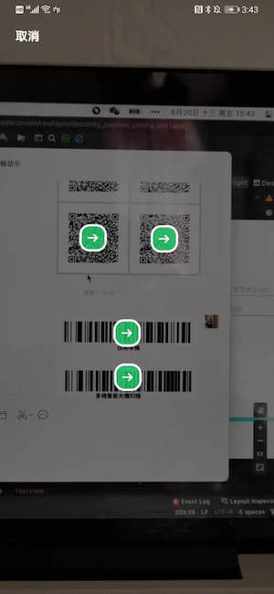
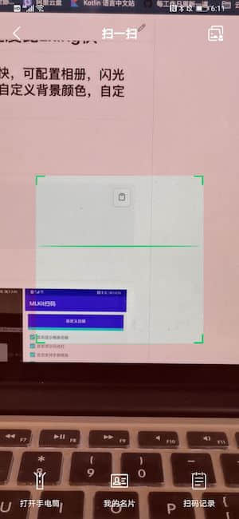
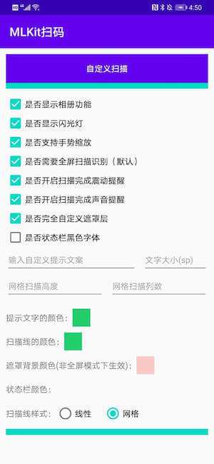

#   MLKitScanner 基于Google MLKit 快速集成二维码扫描,速度比zxing快

##  基于Google MLKit 快速集成二维码扫描，速度比zxing快，可配置相册，闪光灯，相机可以调整焦距放大缩小，自定义扫描线颜色，自定义背景颜色，自定义遮罩层，支持同时扫多个二维码和条形码

##  功能：
    1：二维码扫描，手势缩放，无拉伸，样式自定义
    2：相册中选取图片识别
    3: 相机可以调整焦距放大缩小
    4: 完全自定义遮罩层
    5: 支持微信多个二维码/条形码同时扫描


## 截图:

<div align="center">





</div>

## 如何添加
### Gradle添加：
#### 1.在Project的build.gradle中添加仓库地址

``` gradle
	allprojects {
		repositories {
			...
			maven { url "https://jitpack.io" }
		}
	}
```

#### 2.在Module目录下的build.gradle中添加依赖
``` gradle
	dependencies {

            implementation 'com.github.maning0303:MLKitScanner:V1.0.0'

	}
```

## 使用方法:
###  进入需要提前申请相机权限；进入需要提前申请相机权限；进入需要提前申请相机权限；


``` java
        1：开始扫描：
            //默认扫描
            ScanManager.startScan(this, new ScanCallback() {
                   @Override
                   public void onActivityResult(int resultCode, Intent data) {
                    switch (resultCode) {
                        case ScanManager.RESULT_SUCCESS:
                            String resultSuccess = data.getStringExtra(ScanManager.INTENT_KEY_RESULT_SUCCESS);
                            break;
                        case ScanManager.RESULT_FAIL:
                            String resultError = data.getStringExtra(ScanManager.INTENT_KEY_RESULT_ERROR);
                            break;
                        case ScanManager.RESULT_CANCLE:
                            showToast("取消扫码");
                            break;
                    }
                   }
            });
            
            //自定义扫描
            ScanConfig scanConfig = new ScanConfig.Builder()
                    //设置完成震动
                    .isShowVibrate(true)
                    //扫描完成声音
                    .isShowBeep(true)
                    //显示相册功能
                    .isShowPhotoAlbum(true)
                    //显示闪光灯
                    .isShowLightController(true)
                    //打开扫描页面的动画
                    .setActivityOpenAnime(R.anim.activity_anmie_in)
                    //退出扫描页面动画
                    .setActivityExitAnime(R.anim.activity_anmie_out)
                    //自定义文案
                    .setScanHintText("xxxx")
                    .setScanHintTextColor("#FF0000")
                    .setScanHintTextSize(14)
                    //扫描线的颜色
                    .setScanColor("#FF0000")
                    //是否支持手势缩放
                    .setSupportZoom(true)
                    //扫描线样式
                    .setLaserStyle(ScanConfig.LaserStyle.Grid/ScanConfig.LaserStyle.Line)
                    //背景颜色
                    .setBgColor("")
                    //网格扫描线的列数
                    .setGridScanLineColumn(30)
                    //网格高度
                    .setGridScanLineHeight(300)
                    //是否全屏扫描,默认全屏
                    .setFullScreenScan(true)
                    //单位dp
                    .setResultPointConfigs(36, 12, 3, colorResultPointStroke, colorResultPoint)
                    //状态栏设置
                    .setStatusBarConfigs(colorStatusBar, true)
                    //自定义遮罩
                    .setCustomShadeViewLayoutID(R.layout.layout_custom_view, new CustomViewBindCallback() {
                        @Override
                        public void onBindView(View customView) {
                            //TODO:通过findviewById 获取View
                        }
                    })
                    .builder();
            ScanManager.startScan(this, scanConfig, new ScanCallback() {
                @Override
                public void onActivityResult(int resultCode, Intent data) {
                    switch (resultCode) {
                        case ScanManager.RESULT_SUCCESS:
                            String resultSuccess = data.getStringExtra(ScanManager.INTENT_KEY_RESULT_SUCCESS);
                            break;
                        case ScanManager.RESULT_FAIL:
                            String resultError = data.getStringExtra(ScanManager.INTENT_KEY_RESULT_ERROR);
                            break;
                        case ScanManager.RESULT_CANCLE:
                            showToast("取消扫码");
                            break;
                    }
                }
            });

        2.提供扫描界面相关方法（自定义遮罩层会使用）：
            /**
             * 关闭当前页面
             */
            ScanManager.closeScanPage();

            /**
             * 打开相册扫描图片
             */
            ScanManager.openAlbumPage();

            /**
             * 打开手电筒
             */
            ScanManager.openScanLight();

            /**
             * 关闭手电筒
             */
            ScanManager.closeScanLight();

            /**
             * 手电筒是否开启
             */
            ScanManager.isLightOn();
```


## 感谢：

[googlesamples/mlkit](https://github.com/googlesamples/mlkit)

[jenly1314/MLKit](https://github.com/jenly1314/MLKit)

[Ye-Miao/StatusBarUtil](https://github.com/Ye-Miao/StatusBarUtil)
